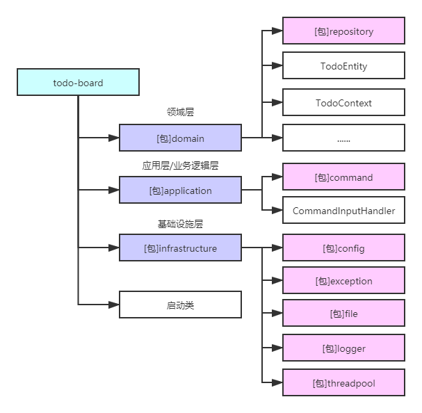
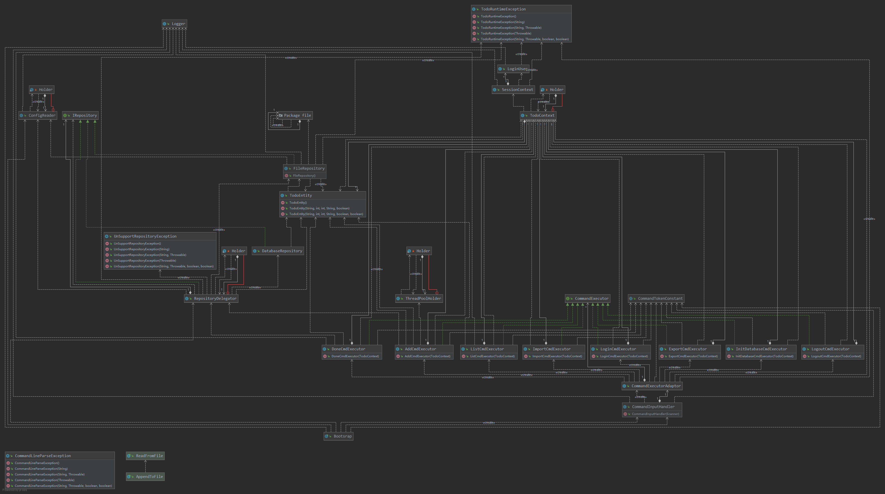

# 待办项看板[命令行界面CLI]

> 极客时间“代码之丑”开头作业

## 内容简介

[内容介绍](bin/mission.md)

## 工程地址

[https://github.com/TaXueWWL/todo-board](https://github.com/TaXueWWL/todo-board)

## 编译方法

1. clone代码，导入IDEA等工具中
2. 编辑 **src/main/resources/app.properties**，修改 **repository.file.root_path** 为你的本地路径
3. 运行 **com.snowalker.todo.board.Bootsrap**

### 使用maven-assembly打包

[maven项目如何打包成jar以便通过java -jar执行](https://blog.csdn.net/u013905744/article/details/81285002)
1. POM文件添加 **maven-compiler-plugin** 以及 **maven-assembly-plugin**，注意在 **maven-assembly-plugin** 中要指定mainClass，
   这样可以避免 **java –jar** 时报找不到主类异常。
2. 在 **intellij idea** 的项目terminal中执行 **mvn compile assembly:single**

    
      <build>
        <finalName>${project.artifactId}</finalName>
        <plugins>
          <plugin>
            <groupId>org.apache.maven.plugins</groupId>
            <artifactId>maven-compiler-plugin</artifactId>
            <version>2.5.1</version>
            <configuration>
              <source>${java.version}</source>
              <target>${java.version}</target>
              <showWarnings>true</showWarnings>
            </configuration>
          </plugin>
          <plugin>
            <groupId>org.apache.maven.plugins</groupId>
            <artifactId>maven-assembly-plugin</artifactId>
            <version>3.1.0</version>
            <configuration>
              <archive>
                <manifest>
                  <mainClass>cn.hfi.App</mainClass>
                </manifest>
              </archive>
              <descriptorRefs>
                <descriptorRef>jar-with-dependencies</descriptorRef>
              </descriptorRefs>
            </configuration>
          </plugin>
        </plugins>
      </build>

### 中文乱码

        // 存在乱码问题
        FileWriter fileWriter = new FileWriter(absoluteTodoFilePath, true);

通过BufferedWriter指定写入的编码        
        
        // 通过这个方式解决中文乱码问题
        BufferedWriter fileWriter = 
            new BufferedWriter (
                    new OutputStreamWriter (
                            new FileOutputStream (absoluteTodoFilePath,true),"UTF-8"));

[Java FileWriter无法编码utf-8 转换方法](https://blog.csdn.net/liyuxing6639801/article/details/69487712)
## 功能模块
> 包结构如下

## 主流程图

## 类图

[IDEA 生成类图的方法](https://www.pianshen.com/article/83981334809/)

## 优化思路
1. 基于IOC框架如：Spring、Guice等进行重构
2. 写文件优化为NIO

